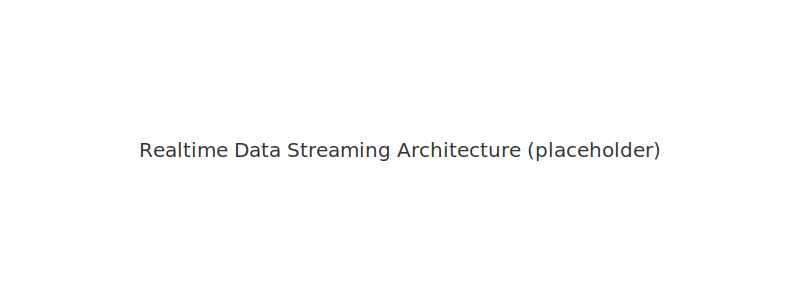

````markdown
# Realtime Data Streaming | End-to-End Data Engineering Project

## Table of Contents

- [Introduction](#introduction)
- [System Architecture](#system-architecture)
- [What You'll Learn](#what-youll-learn)
- [Technologies](#technologies)
- [Getting Started](#getting-started)
- [Watch the Video Tutorial](#watch-the-video-tutorial)

## Introduction

This project serves as a comprehensive guide to building an end-to-end data engineering pipeline. It covers each stage from data ingestion to processing and finally to storage, utilizing a robust tech stack that includes Apache Airflow, Python, Apache Kafka, Apache Zookeeper, Apache Spark, and Cassandra. Everything is containerized using Docker for ease of deployment and scalability.

## System Architecture


The project is designed with the following components:

- **Data Source**: We use `randomuser.me` API to generate random user data for our pipeline.
- **Apache Airflow**: Responsible for orchestrating the pipeline and storing fetched data in a PostgreSQL database.
- **Apache Kafka and Zookeeper**: Used for streaming data from PostgreSQL to the processing engine.
- **Control Center and Schema Registry**: Helps in monitoring and schema management of our Kafka streams.
- **Apache Spark**: For data processing with its master and worker nodes.
- **Cassandra**: Where the processed data will be stored.

## What You'll Learn

- Setting up a data pipeline with Apache Airflow
- Real-time data streaming with Apache Kafka
- Distributed synchronization with Apache Zookeeper
- Data processing techniques with Apache Spark
- Data storage solutions with Cassandra and PostgreSQL
- Containerizing your entire data engineering setup with Docker

## Technologies

- Apache Airflow
- Python
- Apache Kafka
- Apache Zookeeper
- Apache Spark
- Cassandra
- PostgreSQL
- Docker

## Getting Started

1. Clone the repository:

   ```bash
   git clone https://github.com/airscholar/e2e-data-engineering.git
   ```

2. Navigate to the project directory:

   ```bash
   cd e2e-data-engineering
   ```

3. Run Docker Compose to spin up the services:
   ```bash
   docker-compose up
   ```

For more detailed instructions, please check out the video tutorial linked below.

## Watch the Video Tutorial

For a complete walkthrough and practical demonstration, check out our [YouTube Video Tutorial (on going)]().

````
# Real-time Kafka -> Spark -> Cassandra pipeline (Docker)

This project demonstrates a local end-to-end streaming pipeline using Docker Compose.



Services:
- Zookeeper
- Kafka
- Schema Registry
- Cassandra
- Spark (master + worker)
- Airflow
- Producer (Python)

How to run (Linux / WSL / Docker Desktop):

1. Start the stack:

```bash
docker compose up -d --build
```

2. Initialize Cassandra (once):

```bash
docker exec -i $(docker ps -qf "name=cassandra") cqlsh -f /init_cassandra.cql
```

3. Start the producer (sends events to topic `events`):

```bash
docker compose run --rm producer
```

4. Submit Spark job (example):

```bash
./scripts/spark_submit.sh
```

Airflow DAG: `airflow/dags/kafka_to_cassandra_dag.py` will run the producer and then call the spark submit helper.

Verify: connect to Cassandra and query `SELECT * FROM events_keyspace.events LIMIT 10;`.

Notes:
- This is a minimal demo for local development. Production deployments need more secure configs, proper replication, and resource tuning.

Troubleshooting:
- If Kafka clients cannot connect, ensure the broker advertised listeners are reachable from your host. Try using `localhost:29092` from host tools.
- If Spark cannot find the Cassandra connector, you may need to add the connector jar to the Spark image or use the Datastax Spark Cassandra connector package with spark-submit `--packages`.
- Airflow may require additional configuration (init DB, users). For quick tests, run the `airflow` container and open `http://localhost:8082`.

Verification steps:
1. Start the stack: `docker compose up -d --build`
2. Initialize Cassandra: `docker exec -i $(docker ps -qf "name=cassandra") cqlsh -f /init_cassandra.cql`
3. Run the producer for a short time: `docker compose run --rm producer` (Ctrl+C to stop)
4. Submit Spark job: `./scripts/spark_submit.sh`
5. Query Cassandra: `docker exec -it $(docker ps -qf "name=cassandra") cqlsh -e "SELECT * FROM events_keyspace.events LIMIT 10;"`

Next steps / improvements:
- Add schema-registry Avro serialization and use Confluent serializers.
- Harden Docker images and add resource limits for Spark and Cassandra.
- Create automated integration tests that run the full stack and assert rows in Cassandra.
